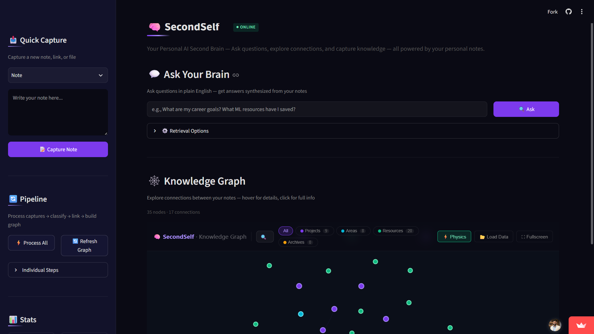
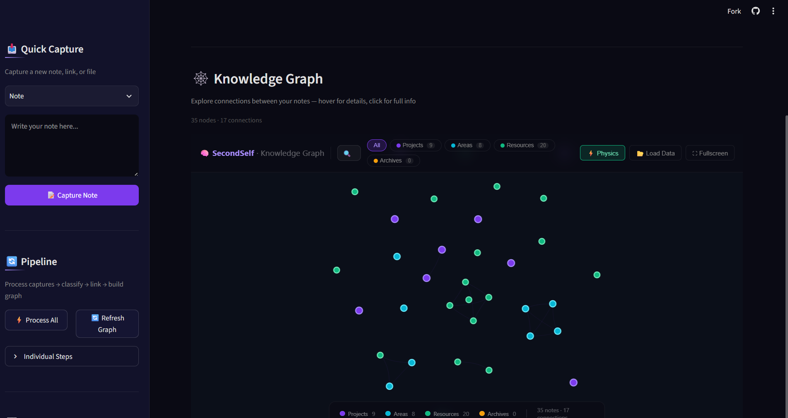

<div align="center">

<!-- ═══════════════════════════════════════════════════════════
     HERO BANNER — replace with your actual banner image
     Recommended size: 1200×400px, dark-themed
     ═══════════════════════════════════════════════════════════ -->


<br/>

<h1>🧠 SecondSelf — Personal AI Second Brain</h1>

<p>
  <strong>Capture anything. Organize automatically. Ask your own knowledge. Visualize everything.</strong><br/>
  A self-organizing knowledge system powered by local embeddings + Groq AI.
</p>

<br/>

<!-- BADGES -->
[](https://python.org)
[](https://streamlit.io)
[](https://groq.com)
[](LICENSE)
[](https://github.com/YOUR_USERNAME/secondself/stargazers)
[](https://github.com/YOUR_USERNAME/secondself/issues)

<br/>

[🚀 Live Demo](https://secondself.streamlit.app/) &nbsp;·&nbsp;
[🐛 Report Bug](https://github.com/biswajitbiswal-in/secondself/issues) &nbsp;·&nbsp;
[✨ Request Feature](https://github.com/biswajitbiswal-in/secondself/issues)

</div>


<!-- 🔼 REPLACE THIS IMAGE WITH YOUR DEMO VIDEO / THUMBNAIL 🔼 -->

<br/>
<sub><em>📌 Replace the image above with your actual screen recording, GIF, or video thumbnail</em></sub>

</div>

---

## 📸 Screenshots

<!-- ═══════════════════════════════════════════════════════════
     SCREENSHOTS — replace each src with your actual image paths
     Recommended: export from your running Streamlit app
     ═══════════════════════════════════════════════════════════ -->

<table>
  <tr>
    <td align="center" width="50%">
      
      <br/><sub><b>Dashboard — Notes overview & PARA stats</b></sub>
    </td>
    <td align="center" width="50%">
      
      <br/><sub><b>Knowledge Graph — Interactive visual map</b></sub>
    </td>
  </tr>
  <tr>
    <td align="center" width="50%">
      
      <br/><sub><b>Ask — Plain-English Q&A with source citations</b></sub>
    </td>
    <td align="center" width="50%">
      
      <br/><sub><b>Capture — Add notes, links, or files</b></sub>
    </td>
  </tr>
</table>

---

## 🤔 What Is SecondSelf?

**SecondSelf is your personal AI-powered "second brain"** — a self-organizing knowledge system that captures your notes, web links, and files; automatically sorts and connects related ideas; visualizes everything as an interactive knowledge graph; and lets you ask plain-English questions answered from *your own notes*.

> Instead of remembering **where** everything is, let SecondSelf remember it for you.

| 😩 Everyday Problem | ✅ How SecondSelf Solves It |
|---|---|
| "I saved that article somewhere… where was it?" | Everything is captured into one searchable system |
| "My notes are a mess, I never organize them" | AI auto-classifies into PARA folders with tags & summaries |
| "I can't connect the dots across my notes" | Semantic linking finds and connects related ideas automatically |
| "It's hard to see how my ideas relate" | An interactive **knowledge graph** visualizes all connections |
| "I want to ask questions about what I've saved" | **RAG Q&A** gives grounded answers with source citations |

---

## ✨ Key Features

- **📥 Universal Capture** — text notes, web URLs (auto-scraped), local PDFs and files
- **🗂️ AI Auto-Classification** — Groq/Llama sorts every capture into the PARA system with tags and a one-line summary
- **🔗 Semantic Auto-Linking** — local sentence-transformers find meaning-similar notes and connect them with `[[wikilinks]]`
- **🕸️ Interactive Knowledge Graph** — drag, zoom, hover, and click through your entire knowledge base visually
- **💬 RAG Question Answering** — ask anything in plain English; get answers grounded in your own notes with cited sources
- **⚡ Smart Pipeline** — classify → link → graph runs idempotently; only processes new or changed captures
- **🎨 Dark-Themed Web UI** — clean Streamlit interface with sidebar controls and live stats
- **💾 Zero-Database Setup** — everything lives in plain Markdown + JSON files; fully git-friendly and human-readable

---

## 🧬 How It Works — The Pipeline

```
  YOU  →  raw/           →    wiki/          →  embeddings  →  graph.json  →  ASK
  input    📥 Archivist       🗂️ Librarian       🔗 Linker      🗺️ Cartographer  🔮 Oracle
           Capture +          AI classifies       Semantic        Visual map      RAG Q&A
           timestamp          PARA + tags         auto-linking    of all notes    with sources
```

Every piece of knowledge flows through 4 phases:

| Phase | Name | What Happens |
|---|---|---|
| 1 | **The Archivist** | Raw capture saved with ID + timestamp |
| 2 | **The Librarian** | AI classifies into PARA; semantic links computed |
| 3 | **The Cartographer** | Knowledge graph built from notes + links |
| 4 | **The Oracle** | RAG Q&A: embed question → retrieve notes → synthesize answer |

---

## 🏗️ Project Structure

```
secondself/
│
├── raw/                    # 📥 Inbox — freshly captured content
│   └── {date}_{id}/
│       ├── content.md
│       └── metadata.json
│
├── wiki/                   # 🗂️ Library — processed, organized notes
│   ├── Projects/
│   ├── Areas/
│   ├── Resources/
│   └── Archives/
│
├── data/                   # 💾 Derived data (auto-generated)
│   ├── embeddings.pkl
│   ├── graph.json
│   └── index.json
│
├── lib/                    # 🔧 Shared code library
│   ├── models.py           #     Data structures
│   ├── storage.py          #     File I/O helpers
│   ├── llm.py              #     Groq AI wrapper
│   ├── embeddings.py       #     Semantic similarity engine
│   └── extract.py          #     Text extraction (web, PDF)
│
├── ui/pages/               # 🎨 Streamlit UI pages
├── static/graph.html       # 🕸️ Interactive graph viewer
│
├── capture.py              # Phase 1 — capture anything
├── classify.py             # Phase 2A — AI classification
├── link.py                 # Phase 2B — semantic linking
├── build_graph.py          # Phase 3 — graph builder
├── ask.py                  # Phase 4 — RAG Q&A engine
├── pipeline.py             # 🔁 Orchestrator
├── app.py                  # 🚀 Streamlit entry point
└── config.py               # ⚙️ Central settings
```

---

## 🚀 Getting Started

### Prerequisites

- Python **3.10+**
- A free [Groq API key](https://console.groq.com) (takes 30 seconds to get)

### 1 — Clone & Install

```bash
git clone https://github.com/YOUR_USERNAME/secondself.git
cd secondself

python -m venv venv
source venv/bin/activate        # Windows: venv\Scripts\activate

pip install -r requirements.txt
```

### 2 — Configure Environment

```bash
cp .env.example .env
```

Open `.env` and add your key:

```env
GROQ_API_KEY=your_groq_api_key_here
```

### 3 — Run the Web App

```bash
streamlit run app.py
```

Open **http://localhost:8501** in your browser — you're live! 🎉

---

## 🖥️ Usage

### Web App (Recommended)

```bash
streamlit run app.py
```

Everything you need is in the UI:

| Page | What you can do |
|---|---|
| **Ask Your Brain** | Type any question, get answers with source cards |
| **Knowledge Graph** | Explore your ideas visually — drag, zoom, hover, click |
| **Capture** (sidebar) | Add a note, paste a URL, or upload a file |
| **Pipeline** (sidebar) | Run "Process All" or individual steps |
| **Stats** (sidebar) | See total notes, connections, PARA breakdown |

### Command Line

```bash
# Capture content
python capture.py "My new idea to remember"
python capture.py --link "https://example.com/article"
python capture.py --file ./documents/report.pdf

# Process everything (classify → link → graph)
python pipeline.py process

# Or run individual steps
python pipeline.py classify
python pipeline.py link
python pipeline.py graph

# Ask a question
python ask.py "What did I save about machine learning?"

# Keyword search
python search.py "python"
```

---

## 🛠️ Tech Stack

| Layer | Technology | Purpose |
|---|---|---|
| **Language** | Python 3.10+ | Core runtime |
| **Web UI** | Streamlit | Fast, clean web interface |
| **LLM** | Groq + Llama 3.1 | Classification + Q&A (free tier) |
| **Embeddings** | sentence-transformers `all-MiniLM-L6-v2` | Local semantic similarity |
| **Graph Viz** | vis-network (JavaScript) | Interactive force-directed graph |
| **Web Scraping** | requests + BeautifulSoup | URL content extraction |
| **PDF Parsing** | pypdf | PDF text extraction |
| **Storage** | Filesystem — Markdown + JSON | Human-readable, git-friendly |
| **Config** | python-dotenv | Secure API key management |
| **Deployment** | Streamlit Community Cloud | Free public hosting |

---

## 🌐 Deployment

### Deploy to Streamlit Community Cloud (Free)

1. Push your repo to GitHub (make sure `.env` is in `.gitignore`)
2. Go to [share.streamlit.io](https://share.streamlit.io) → **New app**
3. Connect your repo and set the main file to `app.py`
4. In **Advanced settings → Secrets**, add:
   ```toml
   GROQ_API_KEY = "your_groq_api_key_here"
   ```
5. Click **Deploy** — your public URL is live in ~60 seconds ✅

---

## 🗺️ Roadmap

- [x] Phase 1 — Universal capture (text, URL, file)
- [x] Phase 2 — AI auto-classification + semantic linking
- [x] Phase 3 — Interactive knowledge graph
- [x] Phase 4 — RAG question answering with citations
- [x] Streamlit web app with dark theme
- [ ] Hybrid search (BM25 + semantic)
- [ ] Browser extension for one-click capture
- [ ] Multi-user support with authentication
- [ ] Live graph updates via WebSockets
- [ ] Obsidian vault sync
- [ ] Audio notes + image OCR capture
- [ ] Scheduled auto-processing (inbox watcher)
- [ ] SQLite full-text search layer
- [ ] Re-ranking for more accurate retrieval

---

## 🤝 Contributing

Contributions, issues, and feature requests are welcome!

```bash
# Fork the repo, then:
git checkout -b feature/your-amazing-feature
git commit -m "feat: add amazing feature"
git push origin feature/your-amazing-feature
# Open a Pull Request
```

Please read [CONTRIBUTING.md](CONTRIBUTING.md) before submitting a PR.

---

## 📄 License

Distributed under the **MIT License**. See [`LICENSE`](LICENSE) for details.

---

## 🙏 Acknowledgements

- [Groq](https://groq.com) — blazing-fast LLM inference API
- [sentence-transformers](https://www.sbert.net) — local semantic embeddings
- [Streamlit](https://streamlit.io) — effortless Python web apps
- [vis-network](https://visjs.github.io/vis-network/) — interactive graph visualization
- [Tiago Forte](https://www.buildingasecondbrain.com) — the PARA method that inspired the organization system

---

<div align="center">

<!-- ═══════════════════════════════════════════════════════════
     FOOTER BANNER — optional, replace with your own image
     ═══════════════════════════════════════════════════════════ -->


<br/>

Made with ❤️ by [Biswajit Biswal](https://github.com/biswajitbiswal-in)

⭐ **If SecondSelf helps you, consider giving it a star!** ⭐

</div>
